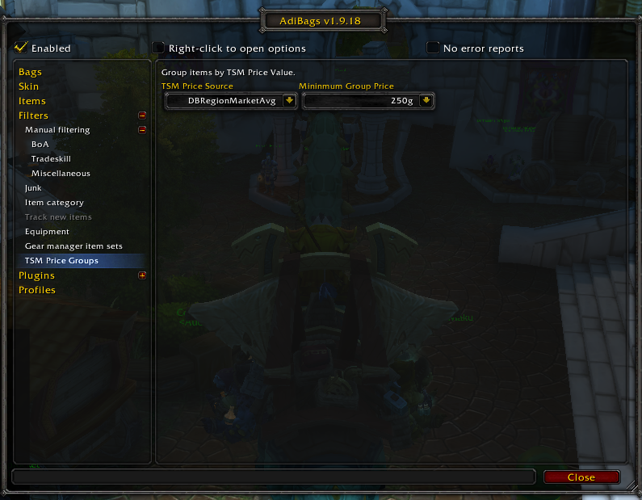

# AdiBags - TSM Price Groups

An addon for AdiBags that adds groups based on the price of the item in TSM.

Through the AdiBags configuration you can select which TSM Price Source to use:

It works with other filters based on the priority you set in the AdiBags filter UI:

# Development
Use the deploy.ps1 script to push the addon from your development folder to your wow folder and then reload the UI to get the changes applied.

To deploy the package, merge a PR to release. Upon merge, it will trigger a GitHub action that will deploy to CurseForge.  Ensure you update the following for each deploy:
- Update the `CHANGELOG.MD`, as this is uploaded to CurseForge
- Update the `.toc` file with a new version number.
